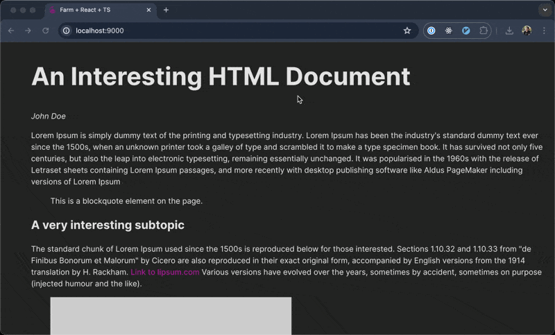

# Speechify Web Functional Test

## Project Overview

Create a "Hover Player" feature. If a user hovers over a paragraph, a play button should appear next to the paragraph. Clicking on this button should start playback.

The only requirement for correctness of functionality is that the core tests (unit and integration) pass, however making improvements to the solution is still encouraged.

### Example of Final Result
Check out this demo video of a working prototype example of the final result:

## Task Details

- `index.html` file contains a simple HTML document consisting of various different kinds of html elements like blockquotes, paragraphs etc. This is the mark up that will render when you run the project and for integration tests.
- The main.tsx file contains the boiler-plate needed, to render the `HoverPlayer` component.
- The play.ts file contains `speechify` function which can be used to perform playback on an element.
- A list of elements to be ignored while parsing readable elements for hover player is also provided in the `./src/lib/parser.ts`. All parsing code should be implemented in this file.

### Implementation Checklist

- [ ] **getTopLevelReadableElements:** Implement a parsing mechanism that gets all the top level readable elements based on heuristics provided. (`./src/lib/parser.ts`)
- [ ] **useHoveredParagraphCoordinate:** Implement functions and hook that lets you get information about the currently hovered element. (`./src/lib/hook.ts`)
- [ ] **UI:** Implement hover player react component. (`./src/lib/HoverPlayer.tsx`). For playback, utilise the `speechify` function in ./src/lib/play.ts
- [ ] **A working prototype of Hover Player feature**: The final result should be a working prototype of the Hover Player feature, where hovering over a paragraph should show a play button. Clicking on this button should start playback. You can utilize the built-in `speechify` function on the `play.ts` file to help you with this.

### Time to Implement

1 Hour 30 Minutes

---
## Special Notes
1. In case you have our [Speechify Chrome Extension](https://chromewebstore.google.com/detail/speechify-text-to-speech/ljflmlehinmoeknoonhibbjpldiijjmm?hl=en) installed in your browser, please disable it during this test to prevent confusion while trying to implement the simplified hover player functionality.
2. Since the task relies on playwright for automated test and playwright dependencies are pretty big, we would recommend you to install Playwright dependencies first by running the 2nd step of the [Setup](#setup) below.

## Setup

1. Clone the repository and run `npm install` to install the dependencies.
2. Install playwright using `npx playwright install chromium --with-deps`.
3. Run `npm test` to run unit tests via vite.
4. Run `npm run playwright` to run integration test.
5. Run `npm run dev` to start the dev server.

## Development Guidelines

### Do's

- Write clean, maintainable, and well-documented code and follow the best practices and coding standards.
- You are free to use any official documentation or language references (MDN, React Docs, etc).
- You can use the debugging tools and native IDE features (only standard Auto-Completion)

### Don'ts

- Do NOT use any external libraries for the implementation.
- DO NOT use any Coding Assistants like GitHub Copilot, ChatGPT, etc or any other AI based tools.
- DO NOT visit direct blogs or articles related to implementation of the tasks.
- DO NOT use Stackoverflow or any other forum websites.
